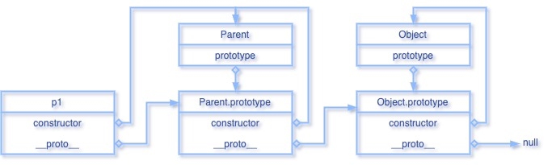

# 原型链

JavaScript 是基于原型的语言, 每个对象都拥有一个原型对象, 对象以原型为模板, 从原型继承方法和属性. 原型对象也可能拥有原型, 并从中继承方法和属性, 一层一层, 以此类推. 这种关系常被叫做 `原型链`. 下图为原型链的示例, 若要搞懂原型链, 则 `prototype`, `__proto__`, `constructor` 这三个属性需要弄清楚.



图示中涉及的函数 Parent 和 p1 实例

```Javascript
function Parent() {
  // native code
}
const p1 = new Parent();
```

## prototype

JavaScript 中, 函数是由 `Function` 构造函数创建的, 即函数也是一个对象, 每个函数都有一个特殊的属性叫做原型 (prototype), 指向一个对象, 称之为原型对象, 它用来实现继承和共享属性

## \_\_proto\_\_

对象独有的内置属性, 指向创建它的构造函数的原型对象, 即 `obj.__proto__` 与 `Constructor.prototype` 的指向相同. `__proto__` 对象已被弃用, 但仍然可以通过对象属性的方式进行获取, 也可通过 ES5 新增的方法 `Object.getPrototypeOf()` 进行获取

## constructor

对象独有的属性, 指向它的构造函数 (创建和初始化对象的函数对象)

## 示例

```JavaScript
function Parent() {
  // native code
}
const p1 = new Parent();

p1.__proto__ === Parent.prototype; // true
p1.__proto__.constructor === Parent; // true

// 普通对象
const o1 = { a: 1 };
const o2 = new Object();
o1.__proto__ === Object.prototype; // true
o2.__proto__ === Object.prototype; // true

```

## Function

首先我们先看下以下例子

```JavaScript
function Parent() {
  // native code
}
Parent.__proto__ === Function.prototype; // true
```

通过前面的概念, 我们知道函数 `Parent` 是 `Function` 的一个实例对象, 所以上面的例子很好理解, 对象的 `__proto__` 指向构造函数 `Function` 的原型对象

### 一个特殊的例子

```JavaScript
Function.__proto__ === Function.prototype; // true
```

每个 JavaScript 函数都是一个 `Function` 对象, 而 `Function` 本身也是一个函数, 即 `function Function() {}`
